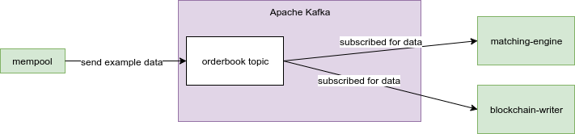
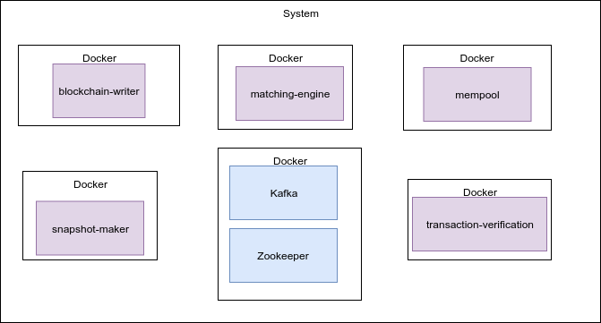

# vDex #

vDex is whole backend side for decentralized exchange that will allow users to trade crypto assets with other users of the wallet, notably in a peer-to-peer fashion without losing custody of the tokens they hold.

## Conventions

* Please follow coding style defined by [`.editorconfig`](http://editorconfig.org)
 and [The Clojure Style Guide](https://github.com/bbatsov/clojure-style-guide)
* Write [good commit messages](https://chris.beams.io/posts/git-commit/)
 and provide an issue ID in a commit message prefixed by `#`


## Prerequisites (you need to install)

* [Java](http://www.oracle.com/technetwork/java/javase/downloads/jdk8-downloads-2133151.html)
```bash
# you should be able to run this in command line
java -version

# result
# java version "1.8.0_144"
# Java(TM) SE Runtime Environment (build 1.8.0_144-b01)
# Java HotSpot(TM) 64-Bit Server VM (build 25.144-b01, mixed mode)
```
* [Leiningen](https://leiningen.org/)
```bash
# you should be able to run this in command line
lein -v

# result
# Leiningen 2.8.1 on Java 1.8.0_144 Java HotSpot(TM) 64-Bit Server VM
```
* [Docker compose](https://docs.docker.com/compose/install/)

Whole project is developed in Clojure.

## Project structure

Project contains 5 microservices as an base for further development:

- `blockchain-writer`
- `matching-engine`
- `mempool`
- `snapshot-maker`
- `transaction-verification`

and core library with main abstraction for whole system

- `libvtx`

Each microservice is placeholder for features that we will implement in the future.  

## Apache Kafka 

3 microservices are connected using `Kafka`:

```
`mempool` -> kafka `orderflow` topic -> `matching-engine`
                                     -> `blockchain-writer`
```

as an example of using `Kafka` to send data between microservices. There will be more in futur
when we make more decisions. Now there is a lot of research going on.



Mempool now contains API for Kafka connection testing. To see the flow when system is running, execute 

```bash
curl -d '{"key":"42", "msg":"foobar"}' -H "Content-Type: application/json" -X POST http://localhost:5002/order
```

It will send dummy message. As an result you should see 2 printed messages in console (as an result of received data by those microservices).

## Microservices

Each microservice folder contains information how to run microservice for development purpouse.

### Blockchain writer

Microservice that will be responsible for writing confirmed transaction into the blockchain.
To verify that it's running, execute

```bash
curl http://localhost:5000
```

Result should be a status 200 response.

### Matching engine

Microservice that will be responsible for matching sell orders (`asks`) and buy orders (`bids`), and creates transactions (trdes).
To verify that it's running, execute

```bash
curl http://localhost:5001
```

Result should be a status 200 response.

### Mempool

Microservice that will be responsible for storing new proposed transactions from the exchange network until they will be verified and propogated further.
To verify that it's running, execute

```bash
curl http://localhost:5002
```

Result should be a status 200 response.

### Snapshot maker

Microservice that will be responsible for saving transactions snapshots to disk for later usage.
To verify that it's running, execute

```bash
curl http://localhost:5003
```

Result should be a status 200 response.

### Transaction verification

Microservice that will be responsible for transactions verification.
To verify that it's running, execute

```bash
curl http://localhost:5004
```

## Running microservices ##

Whose setup is based on Docker.



To run the microservices and Kafka node, run following command from root directory of the repo:

```sh
docker-compose up
```

or for silent start

```sh
docker-compose up -d
```

after Dockerfile changes, run

```sh
docker-compose up -d --build
```

this command takes several minutes to complete.

You can find services running on following ports:

- blockchain-writer `http://localhost:5000`
- matching-engine `http://localhost:5001`
- mempool `http://localhost:5002`
- snapshot-maker `http://localhost:5003`
- transaction-verification `http://localhost:5004`

## libVTX

libVTX is library for working with transactions, balances, deposits and tokens. It will provide API for transaction signing at later stages of development. It will be shared between microservices.

To verify it's running, execute

```bash
curl http://localhost:5005
```

Result should be a status 200 response.

## Performance testing (research results)

As an result of performance testing research we can run simple benchmark example. It will fire 50 requests to hit one services and it will produce some report.

In tab 1
```bash
# start matching engine service in one tab
# for instance
cd matching-engine
lein run
```

In tab 2
```bash
cd test-performance
lein run
```

You will see report in command line

```
Running simulation with number of requests 50 using concurrency distribution function
Running scenario Ping scenario with concurrency 25
Creating report from files in /home/vagrant/development/vdex/test-performance/tmp/Microservicepingsimulation-20180404085712587
Parsing log file(s)...
05:57:13.800 [main] INFO  i.g.c.result.reader.FileDataReader - Collected List(/home/vagrant/development/vdex/test-performance/tmp/Microservicepingsimulation-20180404085712587/input/simulation0.log) from input
05:57:13.814 [main] INFO  i.g.c.result.reader.FileDataReader - First pass
05:57:13.830 [main] INFO  i.g.c.result.reader.FileDataReader - First pass done: read 184 lines
05:57:13.838 [main] INFO  i.g.c.result.reader.FileDataReader - Second pass
05:57:13.899 [main] INFO  i.g.c.result.reader.FileDataReader - Second pass: read 184 lines
Parsing log file(s) done

================================================================================
---- Global Information --------------------------------------------------------
> request count                                         50 (OK=61     KO=0     )
> min response time                                      3 (OK=3      KO=-     )
> max response time                                    605 (OK=605    KO=-     )
> mean response time                                    40 (OK=40     KO=-     )
> std deviation                                        128 (OK=128    KO=-     )
> response time 95th percentile                         27 (OK=27     KO=-     )
> response time 99th percentile                        604 (OK=604    KO=-     )
> mean requests/sec                                  86.28 (OK=86.28  KO=-     )
---- Response Time Distribution ------------------------------------------------
> t < 800 ms                                            50 (100%)
> 800 ms < t < 1200 ms                                   0 (  0%)
> t > 1200 ms                                            0 (  0%)
> failed                                                 0 (  0%)
================================================================================

Open /home/vagrant/development/vdex/test-performance/tmp/Microservicepingsimulation-20180404085712587/index.html with your browser to see a detailed report.
Simulation Microservice ping simulation finished.
```

Open report file generated after test finish (you will get file url in command line).

## Simulation testing (research results)

As an result of simulation testing research you can run some simulation test example. It will simulate 100 users hitting one service. It's very basic idea that will be for us when add more stuff to the project.

In tab 1  
```bash
# start matching engine service in one tab
# for instance
cd matching-engine
lein run
```

In tab 2
```bash
cd test-flow
lein run
```

Simulation report
```
== Simulation: available order schedules ==

|              ID | Duration | Num Users |                      Created |
|-----------------|----------|-----------|------------------------------|
| 382630046467068 | 400 secs |       100 | Wed Apr 04 05:50:53 GFT 2018 |

```
