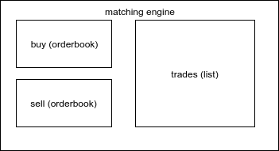
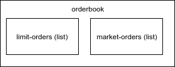
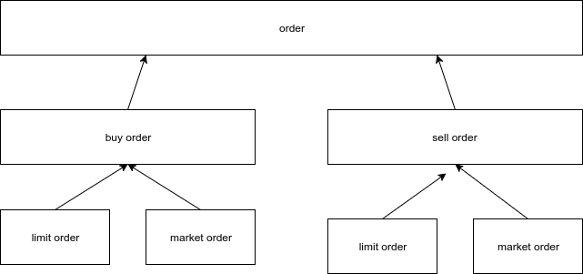

# matching-engine

Matching orders from orders books 

## Developing

### Setup

When you first clone this repository, run:

```sh
lein duct setup
```

This will create files for local configuration, and prep your system
for the project.

### Environment

To begin developing, start with a REPL.

```sh
lein repl
```

Then load the development environment.

```clojure
user=> (dev)
:loaded
```

Run `go` to prep and initiate the system.

```clojure
dev=> (go)
:duct.server.http.jetty/starting-server {:port 3000}
:initiated
```

By default this creates a web server at <http://localhost:3000>.

When you make changes to your source files, use `reset` to reload any
modified files and reset the server.

```clojure
dev=> (reset)
:reloading (...)
:resumed
```

### Testing

Testing is fastest through the REPL, as you avoid environment startup
time.

```clojure
dev=> (test)
...
```

But you can also run tests through Leiningen.

```sh
lein test
```

## Algorithm

### Engine

Each matching engine is responsible for matching orders for only one market (pair of tokens). For instance matching engine fot `BTCETH` market is responsible for matching buy end sell orders in exchange between `BTC` and `ETH` tokens.

Matching engine initialization

```clojure
(engine/init "BTCETH" 10)
```

Each matching engine is also initializad with `reference price`. Engine structure

```clojure
(defrecord MatchingEngine [buy sell accounts trades reference-price])
```
Each matching engine contains 2 orderbooks

- `buy` (bids) - orderbook with buy orders
- `sell` (asks) - orderbook with sell orders
- `accounts` - not used yet
- `trades` - results of match buy and sell order
- `reference-price` - last trade price, it's used in corner case when we match market orders agains other market orders and there is no limit orders available.



### Orderbook

Each orderbook represent one side of a particular market - buy side or sell order

Orderbook can be initialized from collection of orders or empty
```Clojure
;; initialize from orders
(orderbook/from-orders [order-1 order-2] "BTCETH" order/BUY)
;; or empty orderbook
(orderbook/init {:market "BTCETH" :side order/BUY})
```

Matching engine will create orderbook for buy and sell side automatically during initialization.

Orderbook structure

```clojure
(defrecord OrderBook [market side limit-orders market-orders])
```



### Orders

Order is one side of trade proposition for particular market 

```clojure
(defrecord Order [from-address market side amount price])
```

Each order contains:

- `from-adress` sender address
- `market` name of tokens pair (market name), for instance `BTCETH`
- `side` order/BUY (1) or order/SELL (2) - and int value
- `amount` - how many assets do you want to sell or buy 
- `price` - price level on which we want sell or buy an asset

### Order types

Order for each side (buy or sell) might be one of 2 order types:

- `limit order` 
- `market order`



Limit order has price that represents limit. For buy order it indicates maximum price at witch someone is willing to buy some asset. For sell order it indicates minimum price at which someone is willing to sell some asset.

Market order has no price. Market order accepts best price on oposite side or last trade price if there no limit orders on oposite side.

### Trade

Trade is an result of matching buy and sell order. When trade is created than matched orders amount are drained (decreased) by minimum possible amount.

```clojure
(defrecord Trade [buyer-address seller-address market amount price])
```

Trade contains:

- `buyer-address`
- `seller-address`
- `market` market name
- `amount` asset exchange amount
- `price` asset exchange price

### Matching orders

Whole algorithm was implemented based on scala example from https://github.com/prystupa/scala-cucumber-matching-engine

## Legal

Copyright © 2018 FIXME
