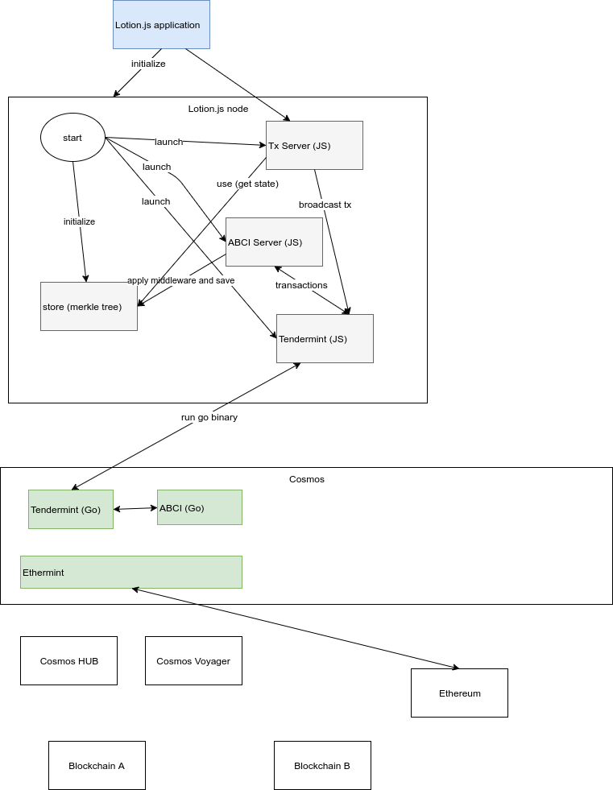

# Cosmos

The goal of a blockchain is to represent a single state being concurrently edited. In order to avoid conflicts between concurrent edits, it represents the state as a ledger: a series of transformations (transactions) applied to an initial state. The blockchain must allow all connected nodes to agree about which transformations are valid, and their ordering within the ledger.

To accomplish this, a blockchain is composed of three protocols:

- `network protocol`,
- `consensus protocol`,
- `transaction protocol`

The `network protocol` is how nodes in the network tell each other about new transactions, blocks, and other nodes; usually a p2p gossip network.

The `consensus protocol` is the set of rules that nodes should follow to determine which particular ordered set of transformations should be in the ledger at a given moment. In Bitcoin, the chain with the highest difficulty seen by a node is treated as authoritatively correct.

The `transaction protocol` describes what makes transactions valid, and how they should mutate the blockchain's state.

## Usage

```bash
npm install lotion
```

## Lotion.js

Lotion is a new way to create blockchain apps in JavaScript. It builds on top of Tendermint using the ABCI protocol so it can easily interoperate with other blockchains on the Cosmos Network using IBC

When you're writing a Lotion app, you're only responsible for writing the transaction protocol. Under the hood, Tendermint is handling the consensus and network protocols. When you start your lotion app, a Tendermint node is also started which will handle all of the communication with other nodes running your lotion app

### Lotion.js app architecture


### 1 - start lotion.js app node

This is example how to launch lotion node and how we can call API from command line.

```bash
# install dependencies
npm install

cd examples/examples/1_start_lotion

# tab 1 - start app
node app.js

# tab 2 - query from command line
sh query_app.sh

## results
# Query state
# {"count":0}

# Create dummy transaction
# {"result":{"check_tx":{"code":0,"data":"","log":"","gas":"0","fee":"0"},"deliver_tx":{"code":0,"data":"","log":"","tags":[]},"hash":"F85EBFB91B6829B6DCA678DF99D8F6472E5CE33B","height":638}}

# Query state
# {"count":1}
```

### 2 - use example Lotion coin

Example custom coin module

```bash
# install Lotion coin
sudo npm install -g lotion      --unsafe-perm=true --allow-root
sudo npm install -g lotion-coin --unsafe-perm=true --allow-root

# tab 1
lcoin init
lcoin start

cd examples/2_lotion_coin
node app.js
```
It will generate:

- credentials.json
My key pair
- initial-state.json
Initial application state
- lotion-data folder
Folder with genesis file, validators and internal data

### 3 - Lotion wallet

Example wallet usage

```bash

cd examples/3_lotion_wallet

npm install

# tab 1 - start app
node app.js

# tab 2 - run wallet
# update GCI addres in wallet-usage.js
node wallet-usage.js
```

## Interesting libraries

### Node

- `SHA` on pure JavaScript 
https://www.npmjs.com/package/sha.js
- native bindings to bitcoin-core/secp256k1
https://www.npmjs.com/package/secp256k1
- Fast elliptic-curve cryptography in a plain javascript implementation
https://github.com/indutny/elliptic
- Search for a key across multiple discovery networks and find peers who answer.
Currently searches across and advertises on the Bittorrent DHT, centralized DNS servers and Multicast DNS simultaneously.Uses the bittorrent-dht and dns-discovery modules.
https://www.npmjs.com/package/discovery-channel
- A tcp/utp server that auto announces itself using discovery-channel. Basically a server-only version of discovery-swarm
https://www.npmjs.com/package/discovery-server
- A network swarm that uses discovery-channel to find peers
https://github.com/mafintosh/discovery-swarm
- Proto Buffer serializtion
https://www.npmjs.com/package/protobufjs
- A JS RPC client for Tendermint nodes.
https://www.npmjs.com/package/tendermint

### Java

- https://github.com/jTendermint
- https://github.com/jTendermint/crypto
- https://github.com/jTendermint/MerkleTree
- https://github.com/jTendermint/jabci