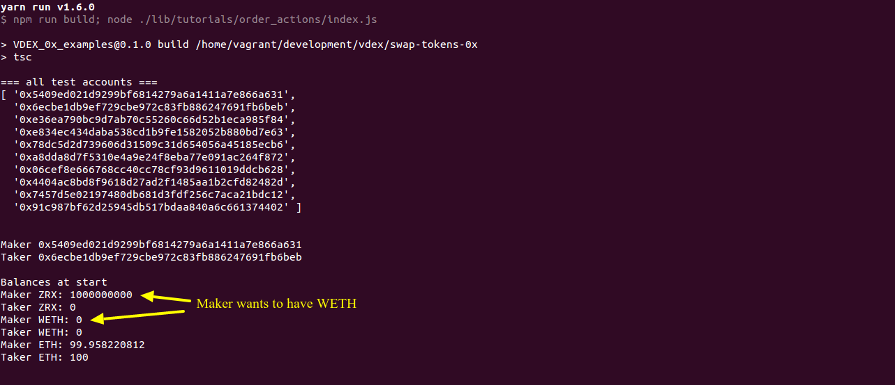
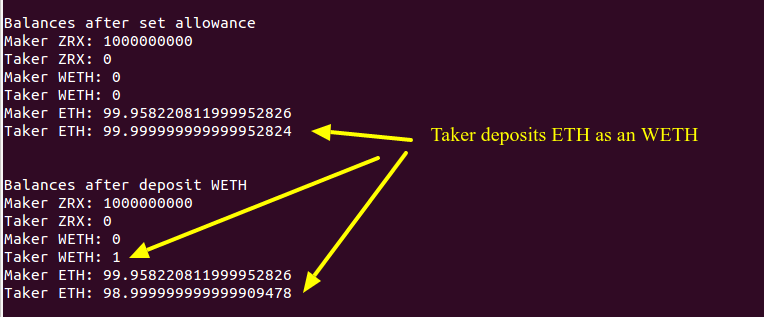
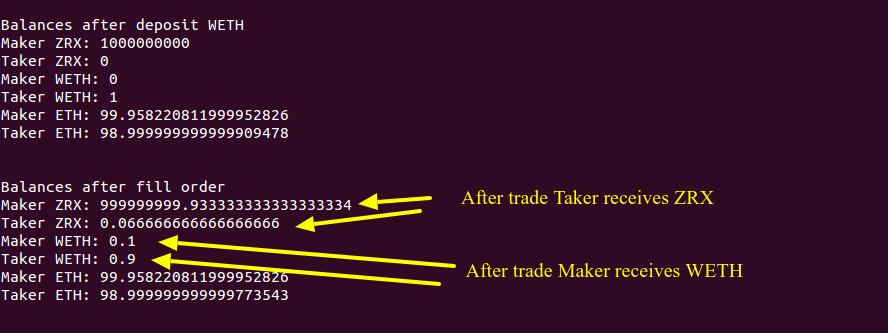
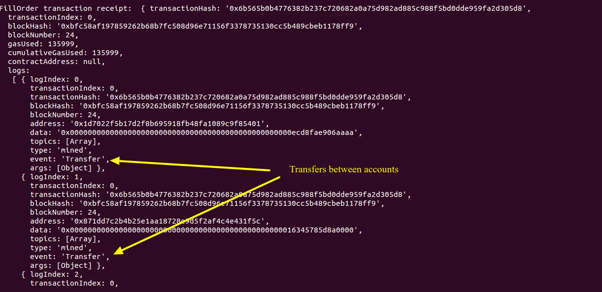

# Example atomic swap

Example of swap two ERC20 Tokens using 0x.  
It will prepare 2 accounts, create order and fill partially this order.  
As an result you will see tokens are transfered between accounts.
Example is wrtten in Typescript and use development test net blockchain (TestRPC).

## Run

Install `yarn`

```bash
# install dependencies
yarn

# download latest TestRPC 0x snapshot with all the 0x smart contracts pre-deployed
yarn download_snapshot

# in tab 1 - launch TestRPC test net for development
yarn testrpc

# in tab 2 - run example trade
yarn order_actions
```
## Results






When you uncomment log statement in `fillOrder` you will see created order debug information

```ts
// if you uncomment it
// console.log('FillOrder transaction receipt: ', txReceipt);
```

